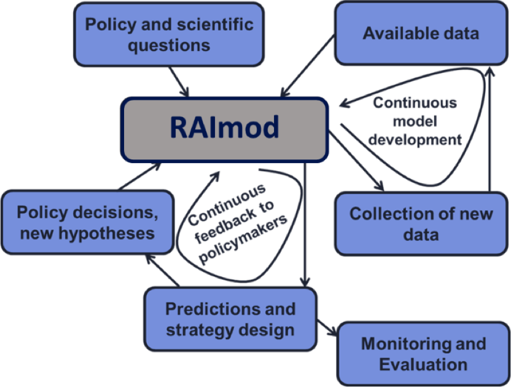

# RAI Model (beta v2)

 

*(text taken from Mahidol university website!)*

กว่า 120 ปี เริ่มตั้งแต่ "โรงศิริราชพยาบาล" ในปี 2431 มาสู่ "มหาวิทยาลัยมหิดล" มหาวิทยาลัยสมบูรณ์แบบที่มีความหลายหลากของสาขาวิชาการทั้งด้านศาสตร์และศิลป์ ถือเป็นแหล่งรวบรวม "ปัญญา" ที่สามารถนำไปใช้ได้จริงเพื่อให้การดำเนินชีวิตและสังคมมนุษย์ได้ประโยชน์สูงสุด ดั่งปณิธานของมหาวิทยาลัยที่มีความหมายลึกซึ้งและยิ่งใหญ่ "ปัญญาของแผ่นดิน"

บทบาทหน้าที่ของมหาวิทยาลัยถือเป็นแหล่งแสวงหาความรู้ สร้างความรู้ และการต่อยอดความรู้ ซึ่งไม่ใช่เพียงความรู้ในตำรา แต่รวมถึงการสร้างบัณฑิตที่พึงประสงค์ของโลกปัจจุบัน เพราะการเรียนรู้ในโลกปัจจุบันไม่เพียงรู้แจ้งหรือ "รู้ลึก" ในศาสตร์ หรืออาชีพของตนเท่านั้น แต่ต้อง "รู้กว้าง" ในทักษะการใช้ชีวิตและการทำงานคือ การคิดวิเคราะห์ การแยกแยะสิ่งใดถูกหรือผิด มีความรับผิดชอบ ซื่อสัตย์สุจริต มีจิตสาธารณะ ปรับตัวได้ดีพร้อมรับการเปลี่ยนแปลง สื่อสารได้ดีมีประสิทธิภาพ หมั่นพัฒนาตนเอง และเป็นผู้นำในการแก้ปัญหาทุกระดับ หรือคุณสมบัติ global professional เพื่อเป็นกำลังสำคัญในการพัฒนาและก่อให้เกิดประโยชน์ต่อสังคมและประเทศชาติอย่างเต็มที่ มหาวิทยาลัยมหิดลในฐานะสถาบันอุดมศึกษาชั้นนำของประเทศจึงมุ่งผลิตบัณฑิตที่พึงประสงค์ออกไปเป็น Global Citizen ภายใต้พระราชดำรัสของสมเด็จพระบรมราชชนก

## Authors

- Sai Thein Than Tun
- Sompob Saralamba
- Shwe Sin Kyaw
- Phetsavanh Chanthavilay
- Olivier Celhay
- Trần Đăng Nguyên
- Trần Nguyễn Anh Thư
- Daniel M Parker
- Maceij F. Boni
- Arjen M Dondorp
- Lisa J White

