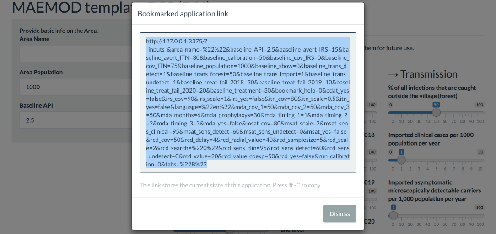
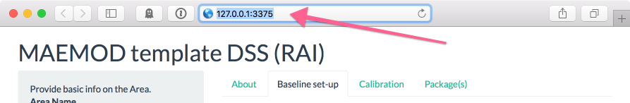

Bookmarking allows you to save the baseline parameters for later use. All parameters from the "Baseline set-up"  tab are saved (from the categories info on area, vector control, treatment and transmission)

(1) Clik on the "Bookmark Parameters" button

 

(2) Copy the text and store it for later (e.g. in a text file)

 

(3) Whenever required, in your internet browser (Firefox, Chrome, Safari...), paste the text in the address bar to restore the bookmarked parameters.

 

