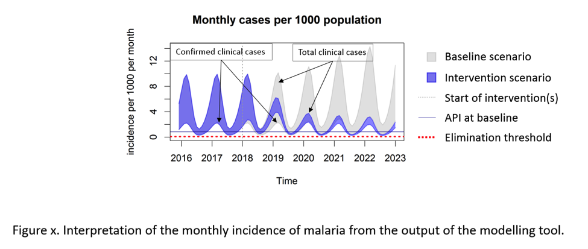
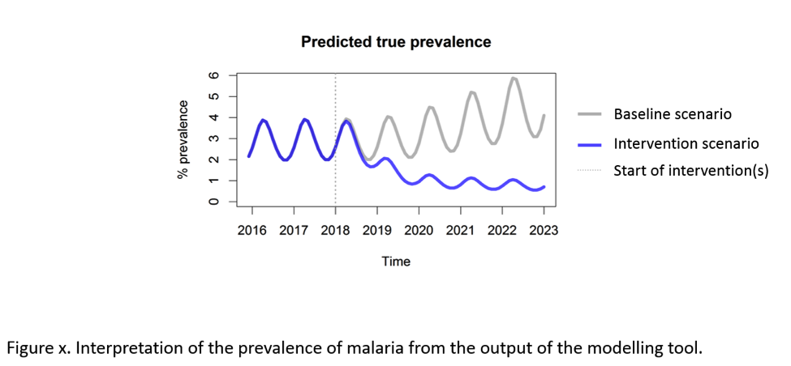

# MalMod malaria elimination strategy design simulation for `r params$area_name`


## Introduction

This is a report generated form the web-based mathematical modelling tool or ‘app’ (named MalMod) to support *Plasmodium falciparum* malaria elimination strategy design. The modelling tool is intended for use by policymakers to support decision-making on malaria elimination strategy at the sub-national level. This tool is not intended as a substitute for high quality epidemiological data and trials of malaria controls. Rather, it is intended for use by National Control Program (NMCP) staff in conjunction with surveillance data and expert knowledge of the malaria situation in their country. The app can then be used to help decide upon the most appropriate package of layered activities expected to be sufficient to eliminate malaria from a geographical area given the unique epidemiological features and pre-existing control measures. Examples of such a geographic area suitable for this tool include state, province, district, township, sub-district or even a village or group of villages.

Here, a report has been generated for `r params$area_name` with the parameters provided below.


## How to interpret the results

There is a graphical output with two lines per graph. There will be a line predicting the expected outcome of a continuation of the baseline scenario (grey). There will be a further line predicting the expected outcome of the package of interventions chosen by the user (blue).  +Some text on interpretation of the output.

<!-- https://stackoverflow.com/questions/35800883/using-image-in-r-markdown-report-downloaded-from-shiny-app -->





## Results


```{r echo=FALSE, fig.height=6, fig.width=6}
plot(1)
```

Some text on interpretation of the result.

## Input Parameters

List or table of input parameters, possibly with the description on each parameter


## Contact for further info


